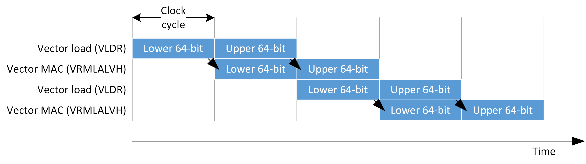
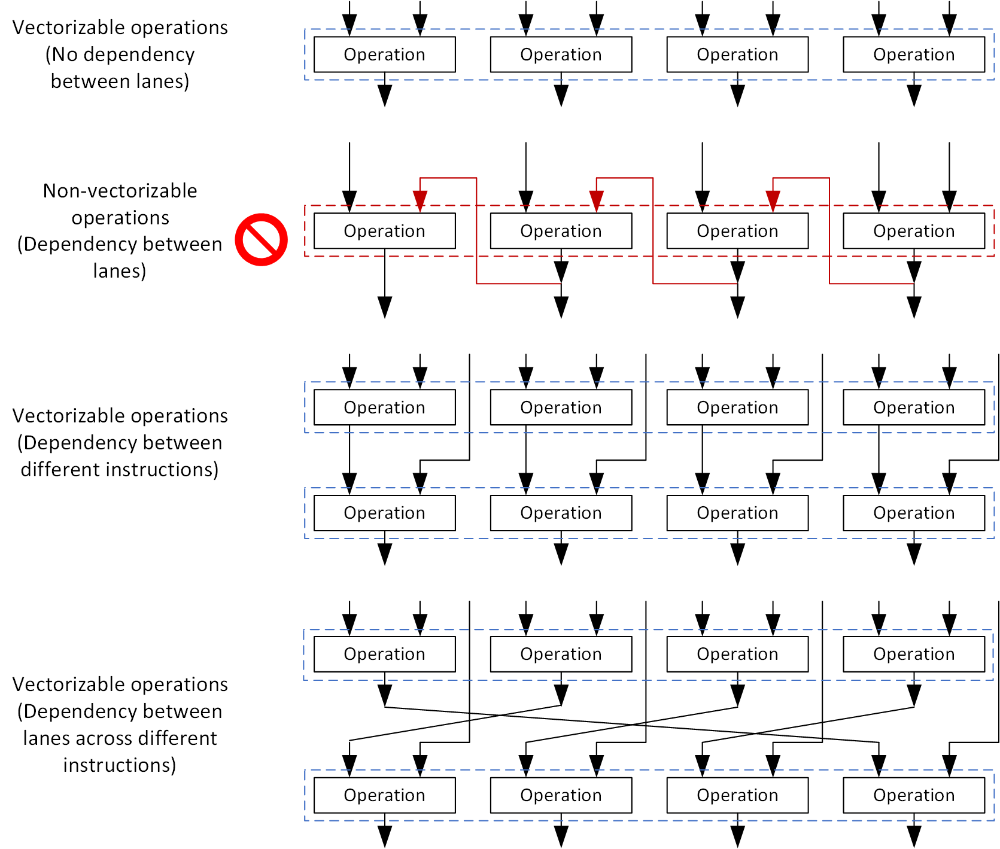
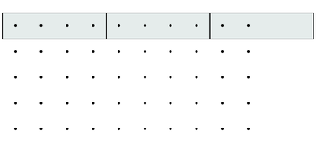
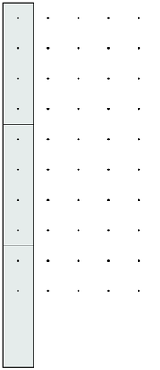

# Helium optimization topics #2 - Optimizing C functions

## Some key concepts

Helium technology is based on SIMD (Single Instruction, Multiple Data) operations, this is also called vector processing as the instructions process vector of data element. The vector size is 128-bit and can contains:
- Four 32-bit data elements (integer or single precision floating-point data) 
- Eight 16-bit data elements (integer or half precision floating-point data)
- Sixteen 8-bit data elements (integer)

To get the best balance between performance and energy efficiency, the current Armv8.1-M processor implementations does not provide a 128-bit wide ALU. Instead, the data processing are handled over multiple clock cycles:

- Cortex-M52 processor provides a 32-bit data path (single beat implementation). So each vector operation take 4 clock cycles to compare.
- Cortex-M55 and Cortex-M85 processors provide 64-bit data path (dual beat implementation). So each vector operation take 2 clock cycles to compare.

To maximize the performance, the processor pipeline allows overlapping of operations in different instruction groups. For example, in a sequence of interleaving memory load and multiply-accumulate instructions, the processor can start processing the first half of the vector while reading the second half of the data. An illustration of the overlapping execution for a dual beat implementation is as follows:



More information about the Cortex-M55 processor can be found in this paper: [Introduction to the Arm Cortex-M55 Processor](https://armkeil.blob.core.windows.net/developer/Files/pdf/white-paper/introduction-to-arm-cortex-m55-processor.pdf)

Generally, C compilers should be able to schedule instructions to interleave different types of instructions to maximize the overlapping. However, if you need to write optimized code at low-level (either using intrinsic functions or inline assembly), you need to take care to interleave different types of instructions by avoiding back-to-back memory accesses or back-to-back data processing that use the same ALU functions.
For software developers that want to optimize code at low level, the following Software Optimization Guides are available:

- [Cortex-M85 Software Optimization Guide](https://developer.arm.com/documentation/107950/0100/)
- [Cortex-M55 Software Optimization Guide](https://developer.arm.com/documentation/102692/latest/)
- Cortex-M52 Software Optimization Guide: (REVISIT: Link not available yet)

## Vectorize a data processing function

One of the first steps in Helium optimization is to ensure that the data processing task is vectorizable. To utilize vector processing capability, the data processing in each vector lane must not have dependencies on the other results within each instruction.



If your code has a sequence of operations that have data dependency (cannot be vectorized), but the sequence needs to be repeated a number of times, it might be possible to modify the code so that operations in different iterations can be grouped together into vectorized operations.

You can utilize auto-vectorization support in C compiler to check whether the code can be vectorized. With Arm Compiler 6 and LLVM compiler, vectorization diagnostic options are available:

```
-Rpass=loop-vectorize -Rpass-analysis=loop-vectorize -Rpass-missed=loop-vectorize
```

In some cases, program loops cannot be vectorized or can be difficult for the compiler to vectorized. These includes:

- Loops with interdependencies between different loop iterations.
- Loops with break clauses.
- Loops with complex conditions.
- Loops where the number of iterations is unknown at loop starts.
- Loops with double-precision floating point processing (low-overhead branch might still be used).
- Loops that involve operations that cannot be vectorized (for example, system operations like memory barriers).

Once you have codes that are vectorizable, you can optionally optimize the code in the loop body by introducing intrinsic functions.

## Reworking loops

In many cases we can improve the performance of data array processing by modifying the loops.

The below pictures represents samples organized in a 2D array (it could be a matrix, a picture ...)

The gray rectangle represent the vector. In this example the vector have 4 lanes (they contain 4 samples) so the datatype of the samples in this example is either `float32` or `q31`.

In the first picture, the array width is much bigger than the array height. So it makes sense to slice the array horizontally and generate vectors from the horizontal slice of data.

At the end, often the final vector will not be full. So the end of the loop (the tail) will need to be handled differently. Helium provides tail predication for this and it is covered in the advanced section. You don't have to use tail predication and can only write a normal scalar code for the tail. It will be less efficient but simpler.



If the data is organized differently (for instance with height much bigger than the width) then you have to slice you data differently to be able to create enough vectors. In the below example the data is sliced vertically. It is ok from a compute point of view : you generate more vector per slice of data. But the problem is that the data is no more contiguous in memory. So loading the data into the vectors is requiring more data accesses and it can cancel the compute optimization. To know if slicing the data vertically is useful for the performances or not, you need to consider the memory accesses as explained in  next section.



Another possibility to make more vectorization possible is to unroll a loop. If you compute 4 iterations of the loop at a time, then perhaps you may put the values of the different iterations in a vector.

It is possible to mix both ideas : vectorizing by slicing the data and adding more vectorization possibilities by unrolling the loop.

In the above examples, we could work on several rows or several columns at the same time

If you work on several rows and columns of the data at the same time, it means you work of sub-rectangles. You may slice those sub-rectangles vertically or horizontally depending on what is making more sense for the algorithms.

In summary : to vectorize the algorithm you need to understand how the data can be covered by vectors. You may cover the data by vertical slices, horizontal slices, rectangles ...

At the end, you must be able to compute with the data you have in a vector and it depends on what you want to compute. Some slicing strategy may be good from a memory point of view but does not map very well on what you are trying to compute.

## Instruction alignment

For best performance, Helium instructions (especially those inside a critical loop) should be aligned to 32-bit boundaries. The software would still work if the Helium instructions were unaligned, but this can cause stall cycles in loops even when the Low Overhead Branch (LOB) extension is used. This is usually taken care by C compilers. But if you are creating inline assembly code, you need to handle the alignment manually.

## Data alignment

When using Helium instructions for data processing, in some cases data alignment can affect the performance:

- For minimum, vector data should be aligned to 32-bit boundaries. This is a requirement of the Helium instructions.
- For Armv8.1-M processors with dual-beat Helium implementations (i.e. Cortex-M55 and Cortex-M85), in some cases aligning vector data to 64-bit boundaries can gain a small performance improvement. For example:
  - When the vector data is expected to be fetched from the main memory instead of cache, having the data aligned to the bus width avoids an additional data access for the unaligned data.
  - When the processing involves certain 64-bit load store instructions

## Minimizing memory accesses (unrolling, data grouping, temporary  copy)

When data is not contiguous in memory, you cannot load it with one vector load and several accesses are needed.

If this data cannot be reused in lot of instructions you won't be able to amortize the cost of loading the data.

Let's take the example of a matrix multiply : you can do a dot product between 4 rows and one column to generate 4 samples of one column of the result. In that case, the data loaded from the column is reused 4 times with 4 different rows.

The overhead of loading the non contiguous data is amortized on the 4 computations. 

Another possibility, when it makes sense, is to copy the non contiguous data into a temporary buffer where the copy will be contiguous. Then, the algorithm can work from this temporary copy.

Unrolling a loop can be useful to reuse some data in several computations. In the example of the matrix multiply, if we were working row per row it would not be efficient since we would be reloading the same column too many times. If we work per packet of 4 rows (so 4 loop iterations at a time), we can reuse the column data.

Unrolling a loop can be useful (as explained in previous section) to provide more flexibility in how you slice your data : sub-rectangles ...

## Helping the compiler (pragma, restrict keyword ...)

Once you have reworked your loops, the inner loop should be the one that the compiler can vectorize. It should work on contiguous data.

You should compile with options that enable the auto-vectorization in your compiler.

Note that auto-vectorization results are highly compiler and code dependent. The result may not be good and in that case you would need to manually vectorize the loop by using Helium intrinsics.

But the most difficult is to rework the loop to prepare them for the vectorization.

Some compiler provides pragma for more control on auto-vectorization and unrolling.

Use of `restrict` keyword in the API of the functions can help a lot the compiler to generate better vectorized code.

It is advised to compile with `-Ofast`

At this stage auto-vectorization support for Helium in GCC is still work in progress. For the time being, use Arm AC6 or LLVM based compiler for best results.

## Considerations related to processor’s memory systems

Many processing tasks like DSP and NN are data intensive, as a result, it is crucial to select the right memory types for data storage to ensure high data access performance (including high bandwidth and low latency). Otherwise, the processing performance can degrade significantly. For example, the I-TCM interface on the Cortex-M55 processor is only 32-bit width and the processor can access 64-bit of data per clock cycle. As a result, it is not a good idea to put read-only data coefficients in the I-TCM if the data is to be read using vector load instructions, even though the data is a part of a DSP function – copying the data into the D-TCM or system memory can help resolve this memory bandwidth issue.

To help performance, the D-caches of the Cortex-M55 and Cortex-M85 processors support data prefetching. In the Cortex-M55, the data prefetcher in the D-cache can only detect a linear access pattern with a constant stride (-2, -1, +1, +2 of the data array). Since a data processing function can access more than one stream of data, other data streams need to be placed in TCMs or uncacheable buffer to make use of the data prefetching.

The data prefetcher in the Cortex-M85 supports an additional prefetching mode call next-line mode, which is more performant. The prefetcher behaviors in the Cortex-M55 and Cortex-M85 are programmable. For more information, please refer to the Prefetch Control Register (PFCR) in the processor’s Technical Reference Manual.

In the Cortex-M55 and Cortex-M85 processors, the D-TCM is divided into 4 banks (selected by bit 2 and bit 3 of the address). Because these processors can handle two load or two store operations when executing scatter store/gather load instructions, if the two accesses are targeting the same D-TCM bank, there would be a conflict and causes delay. Therefore, when using scatter store/gather load instructions, you might need to optimize the data layout to avoid this issue. The bus interface of the Cortex-M52 processor can only handle one transfer at a time, so this consideration is not applicable to the Cortex-M52 processor.

Another side effect of the D-TCM banking in Cortex-M52 and Cortex-M55 is that right after a store to a D-TCM bank, the read to the same D-TCM could be delayed. To avoid this conflict, you can adjust data alignment so that such read after store does not reach the same D-TCM bank. This aspect does not affect memory accesses on AXI or D-TCM interface on Cortex-M85.
