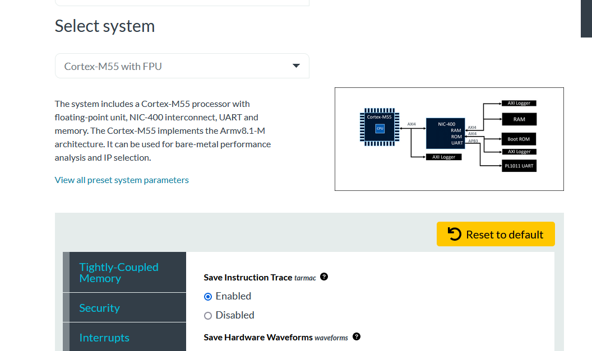

# Introduction

Most of the ML applications generally use a 2-parts DSP front-end and
Neural Network back-end structure.

A DSP Front is needed to reduce the Neural Net complexity as running
brute force ML operations on raw corrupted signals, whatever the signal
nature, which can be audio, vibration, or image, is likely to involve
much bigger networks to reach similar level of performance than smaller
networks operating on cleaned signals.

The DSP front-end typically runs on DSPs or MCUs having good DSP
performance like Cortex-M with Helium.

For illustration of typical ML DSP front-end optimization techniques, we
will use the EEBMC Audiomark benchmark which aimed mimicking a real life
KWS pipeline, running on Cortex-M55.

The techniques described in this document/chapter are not specific to ML
applications, but the presence of the Neural Net software stack has
implication on which parts need to be addressed and how far optimization
should be conducted.

*Note*: All Audiomark scores and profiling data mentioned in this document
are subject to change, depending on platform, toolchain, and library in
use.

## Audiomark Description

Audiomark is a recent EEMBC benchmark, implementing a Keyword spotter
pipeline involving a signal processing front-end consisting of a
2-microphones Acoustic Beamformer (**ABF**), an Acoustic Echo Canceller
(**AEC**), an Acoustic Noise Reductor (**ANR**) and a MFCC spectral
analyser. These components are mainly using single-precision floating
point (F32)

The ML back-end classifier consists of a of a DS-CNN Keyword Spotting
(**KWS**). This one mainly uses 8-bit data type operations. It is an
ARM-based model taken from the <u>Arm Model Zoo.</u>

 - <u></u><https://github.com/ARM-software/ML-zoo/tree/master/models/keyword_spotting/ds_cnn_small/model_package_tf/model_archive/TFLite/tflite_int8><u></u>

More details about the benchmark can be found here:

 - https://www.eembc.org/audiomark/index.php

The source code is available in Github at:

 - https://github.com/eembc/Audiomark

### Scoring

The Audiomark score shall be computed as **iterations per second \* 1000
\* 1.5**.

One iteration consists of an equivalent of processing 24000 samples
sampled at 16kHz.

The Audiomark/MHz score is simply the Audiomark score divided by the
highest core frequency in MHz.

### Helium and Ethos-U support

ABF, which was built from the ground up by EEMBC contributors is using
CMSIS-DSP for spectral transform (real and complex FFT), complex vector
operations (multiplications, dot-product, transpose) and other various
vector operations. As a result, it will automatically benefit from
Helium acceleration when compiled for cores supporting the vector
technology like Cortex-M55 or Cortex-M85.

AEC and ANR, based on LibSpeexDSP, include CMSIS-DSP with extra custom
Helium contributions from ARM. The rationale driving the optimization
additions will be described as follow.

KWS is using an ARM-native model, based on CMSIS-NN library, so as for
the DSP library, it automatically benefits from Helium.

EEMBC rules state that processing offloading is accepted. This will be
typically achieved via DSP, NPU, GPU or Custom Hardware. Arm is
providing Ethos-U55 support for Audiomark to perform KWS offload. We
will see how this could affect optimization decisions for the front-end.

# DSP front-end optimization stages

## Where to start

As for any kind of SW optimization process, it is important to get a
grasp on where and how cycles are spent across the application.

For ML applications, the ratio between the DSP front-end contribution
and the NN back-end contribution is key to determine the level of
optimization which should be achieved. As an example, having a very low
level of cycle contribution in the front-end (let’s say \< 5%), will
tell us that the return of investment (ROI) for optimizing DSP routines
will be marginal and optimizations will not translate in evident
performance improvement.

For these categories, optimization should be limited to low-hanging
fruits and opportunistic type of improvements like replacing loops or
functions with CMSIS-DSP kernels.

Even if these are not immediately translating to a significant
performance boost, these will be beneficial for other generations of
products using the same software because guaranteed to stay aligned with
the latest architectures enhancements.

Enabling Helium for example is likely to change the DSP front-end
contribution versus NN back-end contribution ratio in favor of the first
one for 2 main reasons:

- 8-bit operations involved in a Neural Net will get a higher boost than
  16/32-bit operations involved in the DSP part

- Contrary to NN parts which are predominantly built with standard
  operators and completely covered by the CMSIS-NN library when based on
  TensorFlow Lite for Micro (TFLM) framework, the DSP front-end is never
  a pure aggregate of DSP library routines.

As a result, enabling Helium is generally increasing the relative
front-end contribution compared to its non-Helium counterpart, hence
increasing potential for optimization.

On the other side of the spectrum, enabling NN hardware offloading using
NPUs like Ethos-U will change the ratio even more drastically and
depending on the network, the NPU capabilities and the application
complexity, it is possible to have DSP front-end MCU contribution to be
significantly higher than Neural Network processing, which make
optimization stage even more relevant and necessary.

The following illustration summarize the relative DSP front-end / NN
back-end ratio evolution after Helium and NPU addition.


We will use Audiomark to illustrate these points in the next paragraphs.

## Initial ML application profiling (Cortex-M only)

There are many ways to conduct application profiling. This process can
be classified into 2 main categories: **Active** and **passive** profiling.

**Active** profiling requires developers to add instrumentation through the
software and to collect information like timestamps or PMU events at
specific points. This implies a capability of editing and recompiling
the software and a mechanism to export the profiling information out of
the device or the simulator.

MDK Event Recorder is one possible way for performing such
instrumentation. Documentation can be found in
<https://www.keil.com/pack/doc/compiler/EventRecorder/html/index.html>

In a benchmark like Audiomark, calls to different components are
centralized in a top-level control function **ee_Audiomark_run**. Adding
instrumentation markers around the different component’s entry points,
respectively **ee_abf_f32**, **ee_aec_f32**, **ee_anr_f32** and
**ee_kws_f32** for ABF, AEC, ANR and KWS, allows to derive estimation of
the DSP front-end / NN back-end ratio.

Additional markers can be added inside the font-end components to get
more visibility and decide where to start the optimization process.

When there is no prior knowledge on the cycle repartition, such process
can be tedious, requiring several instrumentation iterations to get a
good overview of the cycle repartition.

Decision for adding markers can be driven by a dichotomy approach or by
visual code inspections and heavy loop identification.

It can be noted that such active profiling can already be part of RTOS
services for tracking task transitions or can be easily enabled when
using stream-based solution like [CMSIS Stream](https://github.com/ARM-software/CMSIS-Stream/) allowing adding Event
Recorder points at node transitions. If the granularity provided by such
a mechanism is not enough, manual instrumentation will still be
required.

On the other hand, passive profiling provides automated methods for
expositing cycle repartition information without SW editing and does not
require prior in-depth knowledge of the code been profiled. This is
generally the most convenient approach for developers but not available
to the majority of the targets. For this reason, it might be interesting
to run the initial profiling pass on one of the ARM FPGA like
[MPS2](https://www.arm.com/products/development-tools/development-boards/mps2-plus)
or
[MPS3](https://www.arm.com/products/development-tools/development-boards/mps3) covering all the Cortex-M Cores and Ethos-U to benefit from their
extended trace capabilities.


**Passive** profiling relies on specific hardware or simulation support
capabilities exposing execution trace to the outside and tools for
processing and presenting the profiling data in a friendly way,

Keil MDK Performance Analyzer (PA) with ETM or Arm Virtual Hardware
associated with TARMAC plugin and TARMAC Trace utilities
([TARMAC-trace-utilities](https://github.com/ARM-software/tarmac-trace-utilities))
falls in this category.

### Audiomark initial profiling

Using Corstone-300 running on an MPS3 FPGA ([AN552](https://developer.arm.com/documentation/dai0552/latest/)) allows to benefit
from passive profiling thanks to ETM. MDK Performance Analyser provides direct access to
the benchmark cycle repartition.

It is possible to run Audiomark entirely from Corstone-300 AN552 2 x
512Kb TCMs, from Internal SRAM with caches enabled or a mixed
environment. In this case, profiling will guide how to best partitioning
code and data between SRAM and TCMs.

#### Cortex-M55 without Helium

Without Helium, Audiomark DSP and ML repartition is respectively 13 and
87 %. Both are largely benefiting from ARMv7M E DSP SIMD operations
available on most of Cortex-M4, Cortex-M7 and Cortex-M33

This already tells us that the ROI optimizing DSP front-end is low,
efforts trying to optimize the front-end won’t translate in a
significant boost in final benchmark score.

The Audiomark console output reports that test duration is **240.0 seconds**
for running 10 iterations, translating to **7.68 billion** instructions.

The score is around `27.77 Audiomarks`, translating to `0.87 Audiomarks /
Mhz` as MPS3 FPGA is running at 32kHz.

The Neural Networks library contribute **87%** of the total load, so an
equivalent of **208.5** sec and involves following CMSIS-NN kernels.

```
- arm_nn_mat_mult_nt_t_s8
- arm_depthwise_conv_3x3_s8
- arm_nn_mat_mult_kernel_s8_s16
- arm_convolve_s8
- arm_avgpool_s8
- arm_s8_to_s16_unordered_with_offset
```

Main ABF, AEC, ANR and MFCC constitute most of the **13 %** remaining
corresponding to an equivalent of **31.2 sec**. These are making use of
CMSIS-DSP FFT, Basic and Complex maths routines (ABF, MFCC), Kiss-FFT
and few filter bank utility routines for the AEC/ANR.

A long tail of low contributing routines is completing the rest of the
processing load.

MDK Performance Analyser reports following cycle repartition over the entire Audiomark
execution (excluding training phase)

| **sorted**                              | **time** | **unit** | **calls** | **contribution** |
|-----------------------------------------|:----------:|:----------:|:---------:|:-------:|
| **arm_nn_mat_mult_nt_t_s8**             | 129.134  | s        | 2976    | **53.83%** |
| **arm_depthwise_conv_3x3_s8**           | 55.626   | s        | 2976    | **23.19%** |
| **arm_nn_mat_mult_kernel_s8_s16**       | 19.024   | s        | 46128   | **7.93%**  |
| **speex_echo_cancellation**             | 4.73     | s        | 930     | 1.97%  |
| **kf_work**                             | 4.295    | s        | 41099   | 1.79%  |
| **speex_preprocess_run**                | 3.494    | s        | 930     | 1.46%  |
| **arm_convolve_s8**                     | 3.354    | s        | 744     | **1.40%**  |
| **ee_abf_f32**                          | 2.989    | s        | 933     | 1.25%  |
| **arm_radix8_butterfly_f32**            | 2.424    | s        | 23064   | 1.01%  |
| **kf_shuffle**                          | 1.582    | s        | 897668  | 0.66%  |
| **arm_cmplx_mult_cmplx_f32**            | 1.58     | s        | 64625   | 0.66%  |
| **\_\_rt_memcpy**                       | 1.571    | s        | 3166397 | 0.65%  |
| **arm_avgpool_s8**                      | 1.135    | s        | 744     | **0.47%**  |
| **kiss_fftr2**                          | 676.409  | ms       | 5586    | 0.28%  |
| **arm_bitreversal_32**                  | 673.855  | ms       | 11904   | 0.28%  |
| **arm_cmplx_dot_prod_f32**              | 597.132  | ms       | 241800  | 0.25%  |
| **kiss_fftri2**                         | 507.789  | ms       | 4728    | 0.21%  |
| **arm_cmplx_mag_f32**                   | 456.814  | ms       | 4464    | 0.19%  |
| **arm_cmplx_conj_f32**                  | 450.293  | ms       | 249176  | 0.19%  |
| **arm_cfft_radix8by2_f32**              | 420.01   | ms       | 11160   | 0.18%  |
| **\_\_hardfp_cos**                      | 343.479  | ms       | 34049   | 0.14%  |
| **kiss_fft_alloc**                      | 342.894  | ms       | 35460   | 0.14%  |
| **spx_fft**                             | 322.079  | ms       | 5588    | 0.13%  |
| **arm_s8_to_s16_unordered_with_offset** | 276.032  | ms       | 93000   | **0.12%**  |
| **stage_rfft_f32**                      | 250.08   | ms       | 744     | 0.10%  |
| **filterbank_compute_psd16**            | 247.051  | ms       | 3061    | 0.10%  |
| **preprocess_analysis**                 | 210.553  | ms       | 937     | 0.09%  |
| **filterbank_compute_bank32**           | 209.734  | ms       | 1977    | 0.09%  |


The non-Helium CMSIS-NN / DSP library used in Audiomark are already
benefiting from ARMv7M-E DSP acceleration supporting dual 16-bit
MAC operation and providing already good uplift compared to the baseline
version. The paper CMSIS-NN: [Efficient Neural Network Kernels for Arm
Cortex-M CPUs](https://arxiv.org/pdf/1801.06601.pdf) describes some of
the key optimizations concepts leveraging DSP instructions, which have
been applied in the original CMSIS-NN version. The operators and data
format in use in this document are no longer in use and have been
superseded with TFLu ones, but the optimization strategies are still
valid.

This optimized code is surrounded by the `ARM_MATH_DSP` compilation
defined directive which is automatically picked by the compiler when
using an Arm MCU having DSP option is available.

#### Cortex-M55 with Helium

Enabling Helium SIMD allows a drastic benchmark duration reduction from
**240** down to **67.3 sec** for 10 iterations and a score growing to `99.06
Audiomark`, equivalent to `3.1 Audiomarks / Mhz` on MPS3.

This gain comes mainly from the vectorization of the CMSIS-NN and DSP
libraries. By using the Cortex-M55 CPU option the compiler will
automatically pick the Helium variants of the libraries.

These are surrounded by `ARM_MATH_MVEI` or `ARM_MATH_MVEF` compilation
defined directives denoting Helium with integer or floating-point data
type.

Half-floating point Helium kernels are surrounded by
`ARM_MATH_MVE_FLOAT16` directives, but these are one in used in current
Audiomark version.

The KWS Neural network part is entirely built with CMSIS-NN kernels,
meaning that all its parts will get accelerated.

On the contrary, the DSP front-end is not a pure aggregate of DSP
library routines, and, as a result, Helium acceleration will be
initially constrained only to parts which are making use of CMSIS-DSP
APIs like the Real FFT or the Complex vector operations, like
multiplication, transpose, and dot inside the ABF.

In addition, 8-bit arithmetic operations heavily used inside the Neural
networks will generally get a bigger boost than single-precision
arithmetic operations used in the DSP front-end kernels.

Combining these 2 effects, explains why DSP front-end contribution ratio
will increase when Helium gets enabled.

Running Audiomark with the MDK Performance Analyser shows that Neural Networks libraries
are now contributing to **67.7 %** of the total load, equivalent of **45.6 sec**
and its top contributing functions are:

```
- arm_nn_mat_mult_nt_t_s8
- arm_nn_depthwise_conv_nt_t_s8
- arm_depthwise_conv_s8_opt
- arm_convolve_s8
- arm_avgpool_s8
```

By comparing the Neural Network processing durations, with and without
Helium, we can quantify the Helium improvement by a factor of `4.6` (208.5
divided by 45.6 sec)

Most of the TFL-u operators will always be handled in an optimized
manner inside CMSIS-NN library and we don’t expect SW developers to
re-implement these by themselves or re-improve these further without
prior checking with ARM.

New APIs are continuously being added and updated, so it’s important to
stay close to the latest releases of the CMSIS-NN library.

##### arm_nn_mat_mult_nt_t_s8 optimizations

Here we will describe a typical Helium optimization as applied in the
CMSIS-NN library and focus on the top contributing kernel involved in
the Audiomark DS-CNN, reported by the MDK Performance Analyser: the
**arm_nn_mat_mult_nt_t_s8 s8** matrix multiplication with the transposed
right-hand-side (RHS) matrix utility function. Source code can be found
in CMSIS-NN git repository inside ARM-software.

<https://github.com/ARM-software/CMSIS-NN/blob/main/Source/NNSupportFunctions/arm_nn_mat_mult_nt_t_s8.c>

Without Helium, the inner loop optimization technique is based on the
maximization of ARMv7M-E dual 16-bit mac operations (`SMLAD`) and
minimization of 8-bit to 16-bit extensions (`SXTB16`) by minimizing reload
occurrences of matrix elements and work on expanded elements inside the
general-purpose registers (GPRS). To make optimal use of the GPRS, the
loop is heavily unrolled to process blocks of 2x16 matrix inputs and to
generate 2x2 matrix outputs.

The inner loop extract can be found below:

```C
for (; rhs_cols_idx <= (rhs_cols - 16); rhs_cols_idx += 16)
{
    val1 = arm_nn_read_s8x4_ia((const int8_t **)&rhs_ptr);
    val0 = arm_nn_read_s8x4_ia((const int8_t **)&lhs_ptr);

    val2 = SXTB16(val1);            val3 = SXTB16(val0);
    val1 = SXTB16_RORn(val1, 8);    val0 = SXTB16_RORn(val0, 8);

    res00 = SMLAD(val3, val2, res00);
    res00 = SMLAD(val0, val1, res00);

    val4 = arm_nn_read_s8x4((const int8_t *)&rhs_ptr[rhs_off0]);
    val5 = SXTB16(val4);            val4 = SXTB16_RORn(val4, 8);

    res01 = SMLAD(val3, val5, res01);
    res01 = SMLAD(val0, val4, res01);

```

Ignoring the loop handling overhead, the inner loop runs in
approximately **80 cycles** and process 32 dual 16-bit MAC operations, hence a MAC cost of
**1.25 cycle per MAC**.

The Helium version of the **arm_nn_mat_mult_nt_t_s8 s8** operates in a
slightly different manner as does not require the extra complexity
needed to fully benefit from the in-register SIMD capability.

It simply runs operations on 4 adjacent rows consisting of four 8-bit
vector load (`VLDRB`) for the left-hand side rows, one vector load for the
right-hand side columns and four 8-bit dot-product (`VMLADAVA`).

It is also opportunistically computing the summation over the RHS-matrix
column which is used later for quantization (`VADDVA`).

The inner loop structure of the Helium variant can be found below:

```ASM
   vldrb.8         q0, [%[col]], #16
2:
   vaddva.s8      %[sum], q0
   vldrb.8         q1, [%[row0]], #16
   vmladava.s8    %[out0], q0, q1
   vldrb.8         q2, [%[row1]], #16
   vmladava.s8     %[out1], q0, q2
   vldrb.8         q3, [%[row2]], #16
   vmladava.s8     %[out2], q0, q3
   vldrb.8         q4, [%[row3]], #16
   vmladava.s8     %[out3], q0, q4
   vldrb.8         q0, [%[col]], #16
   letp            lr, 2b
1:

```


ARMv8.1-M provides low overhead loop handling, therefore total loop cost
after the first iteration is **10 cycles** to process 4 x 16 8-bit MAC,
hence a MAC cost of **0.1562 cycle per MAC**, which is an 8 times boost over the
scalar version.

It can be noted that such loop is a good target for auto-vectorizer and
a plain C form as follow can be used:

```C++
for (int j = 0; j < rhs_cols; j++)
{
    int32_t col = col_base[j];
    sum_tmp += col;
    acc_n0 += lhs_vec[j] * col;
    acc_n1 += ip_row_1[j] * col;
    acc_n2 += ip_row_2[j] * col;
    acc_n3 += ip_row_3[j] * col;
}

```

*Note about Cortex-M55 Helium loop performance analysis*

Tools like [LLVM-MCA](https://www.llvm.org/docs/CommandGuide/llvm-mca.html) are able to give some interesting hints about loop performance by providing static scheduling information as seen by the compiler. The level of precision can differ from real behavior and **LLVM-MCA** does not track some of the dynamic behaviors like memory alignement, DTCM bank conflicts and others, but the tool remains usefull for a quick analysis pass over specific loops.

For this particular **arm_nn_mat_mult_nt_t_s8 s8** loop, where Helium instructions are perfectly distributed between load and artimetic units an IPC of 1 should be expected and is confirmed by **LLVM-MCA**.

```bash
llvm-mca -mtriple=arm-none-eabi -mcpu=cortex-m55 arm_nn_mat_mult_nt_t_s8_loop.s --all-view
```

```
Dispatch Width:    2
uOps Per Cycle:    1.00
IPC:               1.00 <<<
Block RThroughput: 10.0
```

**LLVM-MCA** is also able to reveal the interleaving of the loop instructions dispatched betwwen the Cortex-M55 Helium Units and a timeline showing that no stall occurs.
Details about Cortex-M55 unit partitioning can be found in the [Arm® Cortex®-M55 Processor Software Optimization Guide](https://documentation-service.arm.com/static/63ac5ce1396e6135830ba9fe)

```
Resources:
[0]   - M55UnitALU
[1]   - M55UnitLoadStore
[2]   - M55UnitVecALU
[3]   - M55UnitVecFPALU
[4]   - M55UnitVecSys


Resource pressure per iteration:
[0]    [1]    [2]    [3]    [4]
 -     10.00   -     10.00   -

Resource pressure by instruction:
[0]    [1]    [2]    [3]    [4]    Instructions:
 -     2.00    -      -      -     vldrb.u8     q0, [r0], #16
 -      -      -     2.00    -     vaddva.s8    r2, q0
 -     2.00    -      -      -     vldrb.u8     q1, [r1], #16
 -      -      -     2.00    -     vmlava.s8    r4, q0, q1
 -     2.00    -      -      -     vldrb.u8     q2, [r5], #16
 -      -      -     2.00    -     vmlava.s8    r6, q0, q2
 -     2.00    -      -      -     vldrb.u8     q3, [r7], #16
 -      -      -     2.00    -     vmlava.s8    r8, q0, q3
 -     2.00    -      -      -     vldrb.u8     q4, [r9], #16
 -      -      -     2.00    -     vmlava.s8    r10, q0, q4


Timeline view:
                    0123456789          0123456789          0123456789          0123456789
Index     0123456789          0123456789          0123456789          0123456789

[0,0]     DE   .    .    .    .    .    .    .    .    .    .    .    .    .    .    .   .   vldrb.u8   q0, [r0], #16
[0,1]     .DeE .    .    .    .    .    .    .    .    .    .    .    .    .    .    .   .   vaddva.s8  r2, q0
[0,2]     . DE .    .    .    .    .    .    .    .    .    .    .    .    .    .    .   .   vldrb.u8   q1, [r1], #16
[0,3]     .  DeE    .    .    .    .    .    .    .    .    .    .    .    .    .    .   .   vmlava.s8  r4, q0, q1
[0,4]     .   DE    .    .    .    .    .    .    .    .    .    .    .    .    .    .   .   vldrb.u8   q2, [r5], #16
[0,5]     .    DeE  .    .    .    .    .    .    .    .    .    .    .    .    .    .   .   vmlava.s8  r6, q0, q2
[0,6]     .    .DE  .    .    .    .    .    .    .    .    .    .    .    .    .    .   .   vldrb.u8   q3, [r7], #16
[0,7]     .    . DeE.    .    .    .    .    .    .    .    .    .    .    .    .    .   .   vmlava.s8  r8, q0, q3
[0,8]     .    .  DE.    .    .    .    .    .    .    .    .    .    .    .    .    .   .   vldrb.u8   q4, [r9], #16
[0,9]     .    .   DeE   .    .    .    .    .    .    .    .    .    .    .    .    .   .   vmlava.s8  r10, q0, q4
[1,0]     .    .    DE   .    .    .    .    .    .    .    .    .    .    .    .    .   .   vldrb.u8   q0, [r0], #16
[1,1]     .    .    .DeE .    .    .    .    .    .    .    .    .    .    .    .    .   .   vaddva.s8  r2, q0
[1,2]     .    .    . DE .    .    .    .    .    .    .    .    .    .    .    .    .   .   vldrb.u8   q1, [r1], #16

```

##### CMSIS-NN Helium optimization

As for the **arm_nn_mat_mult_nt_t_s8**, the CMSIS-NN contains native
Helium optimization for most of the typical neural network kernels and
tracks operator format and quantization specifications of TFLu

The complete list of Helium optimizer kernels can be found in
<https://github.com/ARM-software/CMSIS-NN/#mve-extension>

Unless exceptions, like use of alternative data format like single or
half-precision float, it is not expected for SW developers to
re-implement and re-optimize NN kernels with Helium Neural network by
hand.

TFL-u is still evolving, new operators are continuously being added in
the framework, so it’s important to stay close to the latest CMSIS-NN
releases to benefit from Helium accelerated variants.

Some of the recent improvements can be tracked on github [Issues ·
ARM-software/CMSIS-NN ·
GitHub](https://github.com/ARM-software/CMSIS-NN/issues?q=label%3Aimprovement+)

CMSIS-NN is also taking care of compilers having suboptimal Helium
performance like GCC versions lower than version 13.0 by using inline
assembly for selected important kernels.

## Audiomark Front-end optimization

Enabling Helium leads DSP front-end to consume approximately **32.3 %**,
corresponding to **21.7 sec**.

Some parts have also automatically benefited from Helium, mainly thanks
to existing CMSIS-DSP calls in the ABF and MFCC, plus auto-vectorization
opportunities.

The global cycle repartition, gathered with the MDK Performance Analyser is now the
following:

| **Audiomark component**          | **contribution** |
|----------------------------------|:------------------:|
| Neural Net                       | **67.7%**            |
| Kiss FFT (AEC/ANR)               | 13.2%            |
| CMSIS-DSP FFT (ABF, MFCC)        | 2.0%             |
| ANR                              | 5.7%             |
| ABF                              | 3.6%             |
| AEC                              | 4.6%             |
| MFCC                             | 0.1%             |
| CMSIS-DSP misc. (ABF and MFCC)   | 1.5%             |
| Misc (memcpy, memset, math.lib.) | 1.8%             |


At this stage, further improvements in the front-end will start making
visible effects on the benchmark score.

Before digging into straight Helium conversion, it is recommended to try
identifying if certain CMSIS-DSP kernels could possibly be used as a
replacement of existing SW fragments.

This library covers most of the standard signal processing APIs, derived
for all data parts so it can be expected to find equivalence with some
of the DSP front-end parts.

Audiomark ANR and AEC components are based on the LibSpeexDSP libraries
which are heavily relying on traditional signal processing techniques
involving spectral manipulation involving Fourier Transform and other
vector operations and consequently, chances of finding suitable CMSIS
DSP kernels match are high.

### ANR & AEC FFT wrapper

LibSpeexDSP Spectral transformation is operated using a FFT wrapper,
allowing choosing platform specific optimized real FFTs. This greatly
simplifies the addition of CMSIS-DSP RFFT which should be called from
the **spx_fft/ spx_ifft** wrappers.

Since FFT output format is not standardized, care must be taken to
ensure that the optimized FFT samples order and scaling is consistent
with the original SW.

CMSIS-DSP F32 RFFT is producing its sample using a MATLAB-like order,
which does not match the expected LibSpeexDSP format, therefore extra
conversion is needed.

CMSIS-DSP RFFT output format is described in:

<https://arm-software.github.io/CMSIS-DSP/main/group__RealFFT.html>

All elements are complex pairs, even real DC and FO frequency elements
which have imaginary parts set to 0.

On the other hand, LibSpeexDSP, which makes use of default KISS FFT,
assumes an alternative format where the 1<sup>st</sup> element
containing DC frequency is real only, followed by complex pair of
spectral elements.

Is it also expected that forward FFT is scaling output data by the
inverse of FFT length and backward FFT by FFT length. CMSIS-DSP FFT is
scaling scheme is different, requiring extra gain corrections.

To avoid this sample reshuffling and rescaling stage, it is possible to
modify the AEC and ANR FFT consumers to work on the native CMSIS-DSP
order, but it could involve numerous changes across the LibSpeexDSP
library.

Given its marginal cost compared to FFT and the rest of the operations,
it is acceptable to keep it at the current optimization stage.

###  CMSIS-DSP additions replacement

For DSP applications cases like Audiomark ANR/AEC, adding CMSIS-DSP
functions requires a visual source code analysis of the different loops.
Unfortunately, there is no automated procedure allowing to map some of
the suitable DSP operations to CMSIS-DSP API.

Identification and replacement of commonly DSP operations with CMSIS-DSP
operators requires a little bit of experience. It can be assumed that
ARM DSP library, which is heavily used by numerous partners, does not
have any evident miss in its offering, any standard operation will be
present and will have Helium support. As for CMSIS-NN, the library is
actively maintained by ARM, and it is recommended to stay close to
recent releases to get the most exhaustive covering.

Obvious substitutions can be deduced from DSP functions names or source
code documentation highlighting the purpose of the DSP kernel.

Here are few examples taken from Audiomark ANR and AEC

Power spectrum operation:
```C
static inline void power_spectrum(const spx_word16_t *X, spx_word32_t *ps, int N)
{
   int i, j;
   ps[0]=MULT16_16(X[0],X[0]);
   for (i=1,j=1;i<N-1;i+=2,j++)
   {
      ps[j] =  MULT16_16(X[i],X[i]) + MULT16_16(X[i+1],X[i+1]);
   }
   ps[j]=MULT16_16(X[i],X[i]);
}

```

The purpose of this **power_spectrum** routine is to compute the
magnitude squared of the elements of a complex data vector (PS\[i\] =
X\[i\]^2 + Y\[i\]^2)

The LibSpeexDSP basic operators can be derived in fixed or floating
point depending on compile options. Their semantics are tainted with a
fixed-point usage which can be confusing initially.

As mentioned above, the libSpeexDSP FFT sample order implies specific
handling of the first and last sample (DC / FO)

The core loop of this function can be mapped to
**arm_cmplx_mag_squared_f32**.

<https://arm-software.github.io/CMSIS-DSP/latest/group__cmplx__mag__squared.html>

Sample 0 specific operation needs to be handled.

```C
void power_spectrum(const spx_word16_t * X, spx_word32_t * ps, int N)
{
    ps[0] = MULT16_16(X[0], X[0]);
    arm_cmplx_mag_squared_f32(&X[1], ps + 1, N - 1);
}

```

Another example is the recurring call to **mdf_inner_prod** in the AEC
to compute the average energy held in a buffer.

```C
static inline spx_word32_t mdf_inner_prod(const spx_word16_t *x, const spx_word16_t *y, int len)
{
   spx_word32_t sum=0;
   len >>= 1;
   while(len--)
   {
      spx_word32_t part=0;
      part = MAC16_16(part,*x++,*y++);
      part = MAC16_16(part,*x++,*y++);
      // HINT: If you had a 40-bit accumulator, you could shift only at the end
      sum = ADD32(sum,SHR32(part,6));
   }
   return sum;
}

```

This routine can be replaced with **arm_power_f32** if both x and y
inputs are equals or **arm_dot_prod_f32**

- <https://arm-software.github.io/CMSIS-DSP/latest/group__power.html>
- <https://arm-software.github.io/CMSIS-DSP/latest/group__BasicDotProd.html>

Few other obvious substitutions can be found by inspecting loops content
which implement inline vector operations. For example, in ANR, there are
several windowing operations running operations using following
structure:

```C
    for (i=0;i<2*N;i++)
      st->frame[i] = MULT16_16_Q15(st->frame[i], st->window[i]);

```

Such loop can be replaced with **arm_mult_f32** for the floating-point
variant.

Next sample is about ANR computed gain application:

```C
   /* Apply computed gain */
   for (i=1;i<N;i++)
   {
      st->ft[2*i-1] = MULT16_16_P15(st->gain2[i],st->ft[2*i-1]);
      st->ft[2*i] = MULT16_16_P15(st->gain2[i],st->ft[2*i]);
   }
   st->ft[0] = MULT16_16_P15(st->gain2[0],st->ft[0]);
   st->ft[2*N-1] = MULT16_16_P15(st->gain2[N-1],st->ft[2*N-1]);

```

This loop implements a complex multiplication by a real vector
containing the different attenuations weights can be achieved by
**arm_cmplx_mult_real_f32.**

<https://arm-software.github.io/CMSIS-DSP/latest/group__CmplxByRealMult.html>

There are several trivial replacements of addition, multiplication,
subtraction, zeroing loops which can be mapped respectively to
**arm_add_f32/ arm_mult_f32/ arm_sub_f32 / arm_fill_f32**

Conversion of 16-bit integer audio sample to float can be accomplished
using the **arm_q15_to_float** operation.

It can also be noted that recent C compilers like LLVM or Arm Compiler6
are able to auto vectorize such trivial loops.

*Note about fixed-point arithmetic.*

Kernels implemented with Fixed-point are generally more challenging for
vectorizers because requiring efficient idiom recognition capabilities
to map saturation, rounding, scaling to the proper instruction.

Arm Compiler 6 can recognize many of these. For example, here is a Q.15
fixed-point addition and multiplication scalar loops and their generated
Helium vectorized low overhead loop:

- Q.15 addition

```C
  while (blkCnt > 0U) {
    *pDst++ = (q15_t) __SSAT(((q31_t) *pSrcA++ + *pSrcB++), 16);
    blkCnt--;
  }

```

```ASM
.LBB0_4:
        dlstp.16        lr, r3
.LBB0_5:                                @ =>This Inner Loop Header: Depth=1
        vldrh.u16       q0, [r0], #16
        vldrh.u16       q1, [r1], #16
        vqadd.s16       q0, q0, q1
        vstrh.16        q0, [r2], #16
        letp    lr, .LBB0_5

```

- Q.15 multiplication

```C
while (blkCnt > 0U) {
    *pDst++ = (q15_t) __SSAT(((q31_t)*pSrcA++ * *pSrcB++) >> 15, 16);
    blkCnt--;
  }

```

```
.LBB0_4:                                @ %vector.body
        vldrh.u16       q0, [r0], #16
        vldrh.u16       q1, [r1], #16
        vqdmulh.s16     q0, q1, q0
        vstrb.8 q0, [r2], #16
        le      lr, .LBB0_4

```
Rounding variants can also be detected, like rounded average for exampke
(`VRHADD`)


```C
*pDst++ = ((int32_t)*pSrcA++ + *pSrcB++ + 1) >> 1;
```

Will lead to

```ASM
 vrhadd.s16      q0, q0, q1
```

After substituting some of the AEC and ANR loops with CMSIS-DSP kernels,
the Audiomark score continues to grow to `108.98 Audiomark` or `3.40
Audiomarks / Mhz`.

The new global cycle repartition, given by the MDK Performance Analyser is now the
following:

| Audiomark component               |       |
|-----------------------------------|:-------:|
| Neural Net                        | **74.5%** |
| CMSIS-DSP FFT (ABF, MFCC)         | 6.3%  |
| ANR                               | 6.0%  |
| ABF                               | 3.9%  |
| AEC                               | 4.5%  |
| MFCC                              | 0.1%  |
| CMSIS-DSP misc.                   | 3.3%  |
| misc. (memcpy, memset, math.lib.) | 1.3%  |

By summing the CMSIS-NN and CMSIS-DSP kernels contribution it can be
estimated that **84%** of the total Audiomark software is covered by
optimized functions, which still leaves a subset of the remaining 16%
for hand-improvement. This might appear as a relatively low percentage,
but Amdhal’s law reminds us that this could substantially affect the
overall gain brough by Helium.

<u>Important Notes regarding CMSIS DSP additions:</u>

It can be inefficient to issue calls to CMSIS DSP routines using tiny
vector length since function call overhead including stack and loop
handling could be costlier than effective arithmetic processing. Use of
link-time-optimization option could remove this overhead through
inlining.

In addition to this important point, it can be inefficient to cascade
multiple consecutive calls to basic CMSIS DSP routines (e.g. Basic and
Complex Math group) operating on small vector size as requiring several
passes of saving / re-loading of the same data for further processing.
It can be more interesting to create fused variants combining all
operations into one, but this requires some modest amount of
handwriting. This limit, inherent to C language, might be addressed in
future revisions of the DSP libraries, using higher level languages like
C++.


### Hand optimization

Before digging straight into hand-optimization, it is important to
identify remaining hot spots after enabling of ARM optimized NN and DSP
libraries.

MDK Performance Analyser or TARMAC analysis tools can provide statistics about individual
function contribution, but depending on the SW structure, functions
partitioning and compiler inlining decisions, function-level boundary
visibility might not be sufficient.

To increase the level of details concerning cycle repartition it is
possible to:

- Use MDK execution profiler which exposes the total duration associated
  to source code (C or Asm level)

- Prevent function inlining (temporary) by adding compiler specific
  directive like **\_\_attribute\_\_ ((noinline))** supported by Arm
  Compiler, LLVM or GCC.

- Turn loop constructions into small utility functions, with the proper
  (temporary) directive preventing inlining.

By looking at Audiomark functions repartition, after addition of
CMSIS-NN/DSP optimization, top contributing functions are ANR main body
(**speex_preprocess_run**), AEC main body (**speex_echo_cancellation**)
and ABF main body (**ee_abf_f32**).

Most of their subfunctions are inlined when benchmark is compiled with
speed optimization like **Ofast** and do not appear in the function
performance breakdown.

Since these functions are relatively large pieces of SW with many loops
which can be nested, optimization starting point is not obvious at this
stage.

#### MDK Execution profiler

Running Audiomark with the MDK execution profiler exposes time spent by
the CM55 for each line of C code or assembly covered.

Hot spots, which are not surrounded by C functions, can still be visible
by looking at the duration reported by the Execution profiler over
various loop structures.

For example, **699 ms** are spent in one of the echo canceller loops
computing the “*Normal learning rate*” calculation, which, compared to
the total **2.48 seconds**, makes it a good candidate for optimization.

####

#### Turning loops into functions

To get additional insight on the different relative loops contribution,
it can be useful to turn inline loops into individual functions.

This provides following advantages:

- It exposes the loop contribution to the profiler. This still requires
  adding compiler directive to prevent inlining with \_\_attribute\_\_
  ((noinline)) if using AC6/LLVM.

- It eases code / assembly inspection allowing to confirm or not
  auto-vectorization. Additional compiler diagnostic options can give
  hints on what prevent vectorization to succeed (e.g. AC6/LLVM options
  -Rpass=vectorize -Rpass-missed=vectorize -Rpass-analysis=vectorize)

- It allows building simple unit tests to verify hand-optimization
  quality if required.

As seen below, MDK execution profiler identifies one of the hot spot to
be related to Normal learning rate calculation loop. The total
**speex_echo_cancellation** to 2.48 sec and the loop contribution is
**699.2 ms**.


C code extract is the following:

([https://github.com/eembc/Audiomark/blob/main/lib/speexdsp/libspeexdsp/mdf.c](https://github.com/eembc/audiomark/blob/main/lib/speexdsp/libspeexdsp/mdf.c),
line 1230)

```C code
   if (st->adapted)
   {
      /* Normal learning rate calculation once we're past the minimal adaptation phase */
      for (i=0;i<=st->frame_size;i++)
      {
         spx_word32_t r, e;
         /* Compute frequency-domain adaptation mask */
         r = MULT16_32_Q15(st->leak_estimate,SHL32(st->Yf[i],3));
         e = SHL32(st->Rf[i],3)+1;
…
         /*st->power_1[i] = adapt_rate*r/(e*(1+st->power[i]));*/
         st->power_1[i] = FLOAT_SHL(FLOAT_DIV32_FLOAT(r,FLOAT_MUL32U(e,st->power[i]+10)),WEIGHT_SHIFT+16);
      }
   }

```
 
A simple function that will wrap such loop can be created as follows:

```C
void mdf_nominal_learning_rate_calc(spx_word32_t * pRf, spx_word32_t * power, spx_word32_t * pYf, spx_float_t * power_1, spx_word16_t leak_estimate, spx_word16_t RER, uint16_t frame_size)
{
    int             i;

    for (i = 0; i < frame_size; i++) {
        spx_word32_t    r, e;
        /* Compute frequency-domain adaptation mask */
        r = MULT16_32_Q15(leak_estimate, SHL32(pYf[i], 3));
        e = SHL32(pRf[i], 3) + 1;
…
        power_1[i] = FLOAT_SHL(FLOAT_DIV32_FLOAT(r, FLOAT_MUL32U(e, power[i] + 10)), WEIGHT_SHIFT + 16);
    }
}
```

Inline loop will be replaced with a function call:

```C
mdf_nominal_learning_rate_calc(st->Rf, st->power, st->Yf, st->power_1, st->leak_estimate, RER, st->frame_size + 1);
```

For profiling purposes, such functions will have the noinline attribute
to prevent compiler inlining. This attribute will be removed in the
final code. The compiler will decide if inlining is beneficial or not as
long the callee function is visible from its caller source. Link-time
optimization can enable cross-file inlining.

The same process can be repeated for all loops of interests identified
by a profiler.

Audiomark AEC and ANR components are following such approaches and all
the converted loops functions definitions can be found in the following
files:

- lib/speexdsp/libspeexdsp/mfd_opt_generic.c
- lib/speexdsp/libspeexdsp/preprocess_opt_generic.c
- lib/speexdsp/libspeexdsp/filterbank_opt_generic.c

Each Helium optimized function can be individually enabled using
dedicate compile options. Decision on which one to enable depends on
compiler vectorization capabilities and MVE intrinsic handling
performance. More details about this can be found in:

<https://github.com/eembc/Audiomark/tree/main#libspeexdsp-optimizations>

#### Helium Conversion

As mentioned earlier, recent Arm Compilers and LLVM versions can
vectorize loops to apply Helium instructions. Creating small functions
around loops allows one to easily identify which ones can benefit
automatically from compiler optimization without any explicit Helium
additions.

Optimization may still be needed if the compiler involved is not up to
date with the latest Helium vectorization standards and Helium intrinsic
handling which can be found in AC6/LLVM.

As an example, one of the AEC loops, performing smoothing of two signals
implemented the following way:

```C
void smooth_fe_nrg(spx_word32_t * in1, spx_word16_t c1, spx_word32_t * in2, spx_word16_t c2, spx_word32_t * pDst, uint16_t frame_size)
{
    int             j;

    for (j = 0; j <= frame_size; j++)
        pDst[j] = MULT16_32_Q15(c1, in1[j]) + 1 + MULT16_32_Q15(c2, in2[j]);
}
```

Arm Compiler 6.20 or Arm Clang 16.0 using Ofast options will generate
Helium vectorized code:

```ASM
.LBB0_3:
        vmov.f32        q0, #1.000000e+00
        dlstp.32        lr, r4
.LBB0_4:                                @ =>This Inner Loop Header: Depth=1
        vldrw.u32       q1, [r0], #16
        vmov    q2, q0
        vfma.f32        q2, q1, r1
        vldrw.u32       q1, [r2], #16
        vfma.f32        q2, q1, r3
        vstrw.32        q2, [r12], #16
        letp    lr, .LBB0_4
.LBB0_5:
```

*Note*: Wise Helium programmers would observe that the `VMOV`` position is
not optimal. Moving this one before the first vector load would allow to
absorb one stall before the last vector store and the first vector load
of the next iteration.

If benchmark has been compiled with compiler having lagging
auto-vectorization capabilities, loop could make use of MVE intrinsics
and the smoothing routine would be implemented in this following manner:

```C
void smooth_fe_nrg(spx_word32_t * in1, spx_word16_t c1, spx_word32_t * in2, spx_word16_t c2, spx_word32_t * pDst, uint16_t frame_size)
{
    spx_word32_t   *pDst1 = pDst;
    int32_t         blkCnt = frame_size;

    /* Compute 4 outputs at a time */
    while (blkCnt > 0) {
        mve_pred16_t    tpred = vctp32q(blkCnt);
        float32x4_t     vecIn1, vecIn2;
        float32x4_t     vecDst = vdupq_n_f32(1.0f);

        vecIn1 = vld1q_z(in1, tpred);   vecIn2 = vld1q_z(in2, tpred);

        vecDst = vfmaq_m(vfmaq_m(vecDst, vecIn1, c1, tpred), vecIn2, c2, tpred);
        vst1q_p(pDst, vecDst, tpred);
        blkCnt -= 4;

        in1 += 4;       in2 += 4;        pDst += 4;
    }
}
```

*Note*: This implementation uses tail-predicated MVE syntax by converting
loop counter into predicate using `VCTP32Q`, which is then passed to
surrounding intrinsics inside the loop body. At the time of writing, GCC
compiler 13 does not support efficient conversion of tail predicated
loops. A non-predicated variant with extra tail handling will provide
better performance.

There are cases where vectorization process occurs but does not generate
the most optimal code.

As an example, the ANR final Overlap-Add loop is summing two
floating-point signals, saturate, round, convert to 16-bit and store
into a 16-bit integer destination buffer.

```C
void vect_ola(const spx_word16_t * pSrcA, const spx_word16_t * pSrcB, spx_int16_t * pDst, uint32_t blockSize)
{
    int             i;

    for (i = 0; i < blockSize; i++)
        pDst[i] = WORD2INT(ADD32(EXTEND32(pSrcA[i]), EXTEND32(pSrcB[i])));
}
```

Looking at the generated assembly confirms code vectorization, but
saturation/rounding stage does make use of native Helium operators
`VQMOVNBQ`/`VCTAQ_S32_F32` and uses extra compare and select plus
unwanted predicate manipulations.

```ASM
        mov     r4, r0
.LBB0_4:                                @ =>This Inner Loop Header: Depth=1
        vldrw.u32       q2, [r4], #16
        vldrw.u32       q3, [r7], #16
        vadd.f32        q2, q3, q2
        vcmp.f32        ge, q2, r8
        vstr    p0, [sp]                        @ 4-byte Spill
        vldr    p0, [sp]                        @ 4-byte Reload
        vcvt.s32.f32    q3, q2
        vpst
        vcmpt.f32       le, q2, r5
        vpsel   q3, q3, q0
        vldr    p0, [sp]                        @ 4-byte Reload
        vpst
        vcmpt.f32       gt, q2, r5
        vpsel   q2, q1, q3
        vstrh.32        q2, [r6], #8
        le      lr, .LBB0_4
```

The MVE Intrinsic conversion is straightforward once appropriate Helium
operators are in use.

```C
void vect_ola(const spx_word16_t * pSrcA, const spx_word16_t * pSrcB, spx_int16_t * pDst, uint32_t blockSize)
{
    int             i;

    int16x8_t       converted = vdupq_n_s16(0);
    for (i = 0; i < blockSize; i += 4) {
        float32x4_t     vtmp = vld1q(pSrcA) + vld1q(pSrcB);

        converted = vqmovnbq(vuninitializedq(converted), vcvtaq_s32_f32(vtmp));
        vstrhq_s32(pDst, converted);
        pDst += 4;         pSrcA += 4;         pSrcB += 4;
    }
}
```

Finally, there are cases like the **mdf_nominal_learning_rate_calc**
which was identified by the MDK Execution profiler which can
fundamentally not be vectorized as using unsupported Helium features
like vector division or double precision support.

```C
void mdf_nominal_learning_rate_calc(spx_word32_t * pRf, spx_word32_t * power,
                                           spx_word32_t * pYf, spx_float_t * power_1, spx_word16_t leak_estimate, spx_word16_t RER, uint16_t frame_size)
{
    int             i;

    for (i = 0; i < frame_size; i++) {
        spx_word32_t    r, e;
        /* Compute frequency-domain adaptation mask */
        r = MULT16_32_Q15(leak_estimate, SHL32(pYf[i], 3));
        e = SHL32(pRf[i], 3) + 1;
#ifdef FIXED_POINT
        if (r > SHR32(e, 1))
            r = SHR32(e, 1);
#else
        if (r > .5 * e)
            r = .5 * e;
#endif
        r = MULT16_32_Q15(QCONST16(.7, 15), r) + MULT16_32_Q15(QCONST16(.3, 15), (spx_word32_t) (MULT16_32_Q15(RER, e)));
        /*st->power_1[i] = adapt_rate*r/(e*(1+st->power[i])); */
        power_1[i] = FLOAT_SHL(FLOAT_DIV32_FLOAT(r, FLOAT_MUL32U(e, power[i] + 10)), WEIGHT_SHIFT + 16);
    }
}
```

Given that such a loop is still contributing to a non-negligeable part
of the ANR complexity, it is desirable to optimize it.

Removing the double-precision constants which are unneeded here
immediately helps the compiler which can trigger vectorization, except
for the division, which is expected.


```ASM
.LBB0_9:                                @ =>This Inner Loop Header: Depth=1
        vldrw.u32       q5, [r4], #16
        vadd.f32        q5, q5, q1
        vldrw.u32       q4, [r5], #16
        vmul.f32        q4, q4, r11
        vmul.f32        q6, q5, q2
        vminnm.f32      q6, q4, q6
        vmul.f32        q4, q5, r10
        vfma.f32        q4, q6, r9
        vldrw.u32       q6, [r7], #16
        vadd.f32        q6, q6, q3
        vmul.f32        q5, q6, q5
        vdiv.f32        s19, s19, s23
```

With the help of the CMSIS-DSP intrinsic implementing a vector division
emulation (**vdiv_f32**) defined in arm_vec_math.h (and based on the
Newton method, the 4 scalar divisions which are all multicycles on CM55
can be replaced with a faster vector variant.

*Note*: Helium vdiv_f32 division precision might be lower than
`VDIV.F32` therefore it might be important to quantify the deviation.
IEEE-754 compliance might be another point to consider when choosing the
Helium accelerated version. For the Audiomark application, the deviation
introduced by **vdiv_f32** compared to reference is negligeable and ANR
unit test is passing.

The Helium version making use of this **vdiv_f32** operator can be found
below.

```C
void mdf_nominal_learning_rate_calc(spx_word32_t * pRf, spx_word32_t * power,
                                         spx_word32_t * pYf, spx_float_t * power_1, spx_word16_t leak_estimate, spx_word16_t RER, uint16_t len)
{
    int             blockSize = len >> 2;
    float32_t       cst_0_7 = QCONST16(.7, 15);
    float32_t       cst_0_3 = QCONST16(.3, 15);

    do {
        float32x4_t     vecYf = vld1q(pYf);
        float32x4_t     vecRf = vld1q(pRf);

        /* Compute frequency-domain adaptation mask */
        float32x4_t     vecR = vmulq(vecYf, leak_estimate);
        float32x4_t     vecE = vaddq(vecRf, 1.0f);
        float32x4_t     vecEh = vmulq(vecE, 0.5f);

        /* if (r > .5 * e)  r = .5 * e; */
        vecR = vpselq(vecEh, vecR, vcmpgtq(vecR, vecEh));

        vecR = vfmaq(vmulq(vecR, cst_0_7), vmulq(vecE, RER), cst_0_3);

        /*st->power_1[i] = adapt_rate*r/(e*(1+st->power[i])); */
        float32x4_t     vecPwr = vld1q(power);
        vecPwr = vmulq(vecE, vaddq(vecPwr, 10.f));

        vst1q(power_1, vdiv_f32(vecR, vecPwr));

        pRf += 4;
        pYf += 4;
        power += 4;
        blockSize -= 1;
        power_1 += 4;
    }
    while (blockSize > 0);
}
```

#### Effect on score

Adding extra AEC/ANR loop optimizations with Helium allows Audiomark
score to grow from `108.5` or `3.4 Audiomarks / MHz` to `117.4` or
`3.66 Audiomarks / MHz` with a duration of 56.76 seconds.


For a pure Cortex-M55 implementation, without extra side acceleration,
it can be seen that final score is converging.

Adding Helium front-end optimization is no longer paying much and it is
safe to limit further Helium enhancements at this stage.

The DSP front-end / NN back-end repartition is roughly *20* vs *80%*,
equivalent to *11.2* and *45.5* seconds.

## ML application optimization with Ethos-U55

Arm Corstone-300 platform allows Cortex-M55 to be assisted with the
Ethos-U55-128 NPU.

Offloading Audiomark DS-CNN to Ethos-U using the Helium optimized code
baseline will allow to reduce a good amount of the 80% of the NN
execution time when entirely running on Cortex-M55.

The CMSIS-NN processing part will be replaced by the TFL interpreter and
the Ethos-U driver which we can expect to be low in terms of CPU
resource as the full network can be handled by the NPU and no Cortex-M
fallback is required.

The MCU will enter sleep mode after command stream processing by the
Ethos-U driver for the whole duration of the inference until reception
of the Ethos IRQ.

The DSP front-end duration is unaffected and will remain close to 11
seconds.

Thanks to Ethos-U, the total Audiomark duration is reduced to 15
seconds, leading to a score of `450 Audiomarks` or `14.06
Audiomark/Mhz`.

The DSP front-end vs NN back-end balance, seen by the MCU is now
completely reversed with roughly **98** vs **2%**. This excludes the 17% sleep
time while Cortex-M55 waits for the IRQ signaling the end of the
Ethos-U55 processing.

Adding NPU suddenly puts the DSP front-end as the limiting factor for
performance, and new optimizations opportunities, which are obviously
more complex than the ones applied in previous stage, should be
identified.

The same process for searching optimization opportunities described
earlier can be iterated until reaching a point where cycle reduction is
no longer paying.

In the context of Audiomark, the top contributing functions from the DSP
front-end reported by MDK Performance Analyser are the following:

```
- ee_abf_f32 (ABF core)
- arm_cfft_f32 + arm_rfft_fast_f32 
- speex_echo_cancellation (AEC main)
- th_cmplx_mult_cmplx_f32 (used in ABF)
- speex_preprocess_run (ANR)
- arm_cmplx_dot_prod_f32 (used in ABF)
```

### Additional ABF optimizations

Inspecting ABF time annotated sources ([ee_abf_f32.c](https://github.com/eembc/Audiomark/blob/main/src/ee_abf_f32.c#L70))
with the MDK Execution profiler points in the adaptation
loop where most of the cycles are spent. This one is running a loop of
64 iterations running complex conjugate and complex dot product over 6
elements.


This is not efficient for 2 main reasons, which were already mentioned
earlier concerning the use of the CMSIS DSP kernels:

- Vector size involved with 6 complex elements are tiny, and function
  call overhead might be bigger than effective arithmetic operations.

- Chaining CMSIS-DSP complex conjugate and complex dot product calls
  operating on small sizes, causes extra unwanted memory accesses in a
  temporary buffer. Values stored by the complex conjugate are
  immediately read by the complex dot product kernel. Fusing the two
  calls might be more judicious, even if there is no direct CMSIS-DSP
  Kernel equivalent doing these operations at once.


It can also be seen that few other vectorization opportunities are
missing in the loop.

*Note*: A new CMSIS DSP feature, which was experimental at the time of writing this text, enables operator fusion and removing temporary buffer management.
It is using advanced C++ template meta-programming and details can be found here:
https://arm-software.github.io/CMSIS-DSP/main/dsppp_intro.html


### FFT optimizations

CMSIS-DSP Complex FFT and Real FFT which are the second top contributing
functions could benefit from additional optimizations related to some
advantages provided by hand assembly.

Arm Compiler and CLANG are very good at handling Helium Intrinsic based
SW which is found in the CMSIS-DSP library, but there are some tricky
categories of optimizations which cannot be handled by compilers. In the
case of the FFT, reaching optimum point in the Radix-4 kernel requires
making use of software pipelining which is one of the tasks which is
typically too complex to be solved optimally.

For the compiled CFFT Radix-4 loop, **LLVM-MCA** shows an IPC of `0.78`

```
Dispatch Width:    2
uOps Per Cycle:    0.78
IPC:               0.78
Block RThroughput: 28.0

```
It also reveals presence of several adjacent Helium instructions belonging to the same group and which would lead to structural Hazards.

```
Resources:
[0]   - M55UnitALU
[1]   - M55UnitLoadStore
[2]   - M55UnitVecALU
[3]   - M55UnitVecFPALU
[4]   - M55UnitVecSys


Resource pressure per iteration:
[0]    [1]    [2]    [3]    [4]
 -     22.00   -     28.00   -

Resource pressure by instruction:
[0]    [1]    [2]    [3]    [4]    Instructions:
 -     2.00    -      -      -     vldrw.u32    q0, [r1]
 -     2.00    -      -      -     vldrw.u32    q1, [r9]
 -      -      -     2.00    -     vadd.f32     q3, q1, q0
 -     2.00    -      -      -     vldrw.u32    q2, [r11]
 -      -      -     2.00    -     vsub.f32     q0, q1, q0
 -     2.00    -      -      -     vldrw.u32    q4, [r10]
 -      -      -     2.00    -     vadd.f32     q5, q4, q2
 -      -      -     2.00    -     vadd.f32     q6, q5, q3
 -     2.00    -      -      -     vstrb.8      q6, [r9], #16
 -      -      -     2.00    -     vsub.f32     q3, q3, q5
 -     2.00    -      -      -     vldrw.u32    q5, [r5], #16
 -      -      -     2.00    -     vcmul.f32    q6, q5, q3, #0
 -      -      -     2.00    -     vcmla.f32    q6, q5, q3, #270
 -     2.00    -      -      -     vstrb.8      q6, [r11], #16
 -      -      -     2.00    -     vsub.f32     q1, q2, q4
 -     2.00    -      -      -     vldrw.u32    q3, [r0], #16
 -      -      -     2.00    -     vcadd.f32    q2, q0, q1, #270
 -      -      -     2.00    -     vcmul.f32    q4, q3, q2, #0
 -      -      -     2.00    -     vcmla.f32    q4, q3, q2, #270
 -     2.00    -      -      -     vstrb.8      q4, [r1], #16
 -      -      -     2.00    -     vcadd.f32    q2, q0, q1, #90
 -     2.00    -      -      -     vldrw.u32    q0, [r6], #16
 -      -      -     2.00    -     vcmul.f32    q1, q0, q2, #0
 -      -      -     2.00    -     vcmla.f32    q1, q0, q2, #270
 -     2.00    -      -      -     vstrb.8      q1, [r10], #16

```

Effect on the timeline can be visualized as well. Even if estimated timing are differing from real behavior, which can be observed with a cycle accurate Cortex-M55 model, it gives interesting information about Structural and Read after Write Hazards.

```
Timeline view:
                    0123456789          0123456789          0123456789          0123456789
Index     0123456789          0123456789          0123456789          0123456789

[0,0]     DE   .    .    .    .    .    .    .    .    .    .    .    .    .    .    .   .   vldrw.u32  q0, [r1]
[0,1]     . DE .    .    .    .    .    .    .    .    .    .    .    .    .    .    .   .   vldrw.u32  q1, [r9]
[0,2]     .  DE.    .    .    .    .    .    .    .    .    .    .    .    .    .    .   .   vadd.f32   q3, q1, q0
[0,3]     .   DE    .    .    .    .    .    .    .    .    .    .    .    .    .    .   .   vldrw.u32  q2, [r11]
[0,4]     .    DE   .    .    .    .    .    .    .    .    .    .    .    .    .    .   .   vsub.f32   q0, q1, q0
[0,5]     .    .DE  .    .    .    .    .    .    .    .    .    .    .    .    .    .   .   vldrw.u32  q4, [r10]
[0,6]     .    . DE .    .    .    .    .    .    .    .    .    .    .    .    .    .   .   vadd.f32   q5, q4, q2
[0,7]     .    .   DE    .    .    .    .    .    .    .    .    .    .    .    .    .   .   vadd.f32   q6, q5, q3
[0,8]     .    .    DE   .    .    .    .    .    .    .    .    .    .    .    .    .   .   vstrb.8    q6, [r9], #16
[0,9]     .    .    .DE  .    .    .    .    .    .    .    .    .    .    .    .    .   .   vsub.f32   q3, q3, q5
[0,10]    .    .    . DE .    .    .    .    .    .    .    .    .    .    .    .    .   .   vldrw.u32  q5, [r5], #16
[0,11]    .    .    .  DeE    .    .    .    .    .    .    .    .    .    .    .    .   .   vcmul.f32  q6, q5, q3, #0
[0,12]    .    .    .    DeE  .    .    .    .    .    .    .    .    .    .    .    .   .   vcmla.f32  q6, q5, q3, #270
[0,13]    .    .    .    .DE  .    .    .    .    .    .    .    .    .    .    .    .   .   vstrb.8    q6, [r11], #16

```

A perfectly optimized CFFT ASM implementation taking advantage of SW
pipelining in the inner radix-2/4 core loops, provides around 10% gain
compared to a compiled version.

Including an optimal SW pipeliner in a compiler would require an
exhaustive gigantic exploration of all loop construction variations with
different possibilities of pre-amble / post-amble. This would cause
compilation times to explode which is not desirable in commercial
compilers.

Such tasks can be handled by alternative methods like the one described
in <https://eprint.iacr.org/2022/1303.pdf>

Cortex-M55 optimized FFT in assembly can be found in
<https://github.com/ARM-software/EndpointAI/blob/master/Kernels/ARM-Optimized/DSP/Source/TransformFunctions/>

These are using the exact same API found in CMSIS-DSP FFT and can be
easily substituted.


**LLVM-MCA**

```
Dispatch Width:    2
uOps Per Cycle:    0.89
IPC:               0.89
Block RThroughput: 28.0
```

It is highlighting a more optimal way of dispatching instructions. Some unavoidable stalls are remaining, but reduced compared to the compiled version.

```
Resources:
[0]   - M55UnitALU
[1]   - M55UnitLoadStore
[2]   - M55UnitVecALU
[3]   - M55UnitVecFPALU
[4]   - M55UnitVecSys


Resource pressure per iteration:
[0]    [1]    [2]    [3]    [4]
 -     22.00   -     28.00   -

Resource pressure by instruction:
[0]    [1]    [2]    [3]    [4]    Instructions:
 -      -      -     2.00    -     vadd.f32     q6, q0, q2
 -      -      -     2.00    -     vsub.f32     q3, q0, q2
 -     2.00    -      -      -     vldrw.u32    q0, [r0]
 -      -      -     2.00    -     vadd.f32     q7, q0, q1
 -     2.00    -      -      -     vldrw.u32    q2, [r1, #16]
 -      -      -     2.00    -     vsub.f32     q4, q6, q7
 -      -      -     2.00    -     vadd.f32     q5, q6, q7
 -     2.00    -      -      -     vldrw.u32    q7, [r2], #16
 -      -      -     2.00    -     vsub.f32     q1, q0, q1
 -     2.00    -      -      -     vldrw.u32    q0, [r3], #16
 -      -      -     2.00    -     vcmul.f32    q6, q0, q4, #0
 -     2.00    -      -      -     vstrw.32     q5, [r4], #16
 -      -      -     2.00    -     vcmla.f32    q6, q0, q4, #90
 -     2.00    -      -      -     vstrw.32     q6, [r0], #16
 -      -      -     2.00    -     vcadd.f32    q5, q3, q1, #90
 -      -      -     2.00    -     vcmul.f32    q6, q7, q5, #0
 -     2.00    -      -      -     vldrw.u32    q0, [r4]
 -      -      -     2.00    -     vcmla.f32    q6, q7, q5, #90
 -     2.00    -      -      -     vldrw.u32    q5, [r5], #16
 -      -      -     2.00    -     vcadd.f32    q4, q3, q1, #270
 -     2.00    -      -      -     vldrw.u32    q1, [r6, #16]
 -      -      -     2.00    -     vcmul.f32    q7, q5, q4, #0
 -     2.00    -      -      -     vstrw.32     q6, [r1], #16
 -      -      -     2.00    -     vcmla.f32    q7, q5, q4, #90
 -     2.00    -      -      -     vstrw.32     q7, [r6], #16
```

And the timeline view is showing a smoother execution with less pipeline bubbles.

```
                    0123456789          0123456789          0123456789          0123456789
Index     0123456789          0123456789          0123456789          0123456789

[0,0]     DE   .    .    .    .    .    .    .    .    .    .    .    .    .    .    .   .   vadd.f32   q6, q0, q2
[0,1]     . DE .    .    .    .    .    .    .    .    .    .    .    .    .    .    .   .   vsub.f32   q3, q0, q2
[0,2]     .  DE.    .    .    .    .    .    .    .    .    .    .    .    .    .    .   .   vldrw.u32  q0, [r0]
[0,3]     .   DE    .    .    .    .    .    .    .    .    .    .    .    .    .    .   .   vadd.f32   q7, q0, q1
[0,4]     .    DE   .    .    .    .    .    .    .    .    .    .    .    .    .    .   .   vldrw.u32  q2, [r1, #16]
[0,5]     .    .DE  .    .    .    .    .    .    .    .    .    .    .    .    .    .   .   vsub.f32   q4, q6, q7
[0,6]     .    .  DE.    .    .    .    .    .    .    .    .    .    .    .    .    .   .   vadd.f32   q5, q6, q7
[0,7]     .    .   DE    .    .    .    .    .    .    .    .    .    .    .    .    .   .   vldrw.u32  q7, [r2], #16
[0,8]     .    .    DE   .    .    .    .    .    .    .    .    .    .    .    .    .   .   vsub.f32   q1, q0, q1
[0,9]     .    .    .DE  .    .    .    .    .    .    .    .    .    .    .    .    .   .   vldrw.u32  q0, [r3], #16
[0,10]    .    .    . DeE.    .    .    .    .    .    .    .    .    .    .    .    .   .   vcmul.f32  q6, q0, q4, #0
[0,11]    .    .    .  DE.    .    .    .    .    .    .    .    .    .    .    .    .   .   vstrw.32   q5, [r4], #16
[0,12]    .    .    .   DeE   .    .    .    .    .    .    .    .    .    .    .    .   .   vcmla.f32  q6, q0, q4, #90
[0,13]    .    .    .    DE   .    .    .    .    .    .    .    .    .    .    .    .   .   vstrw.32   q6, [r0], #16
[0,14]    .    .    .    .DE  .    .    .    .    .    .    .    .    .    .    .    .   .   vcadd.f32  q5, q3, q1, #90
[0,15]    .    .    .    .  DeE    .    .    .    .    .    .    .    .    .    .    .   .   vcmul.f32  q6, q7, q5, #0
[0,16]    .    .    .    .   DE    .    .    .    .    .    .    .    .    .    .    .   .   vldrw.u32  q0, [r4]
[0,17]    .    .    .    .    DeE  .    .    .    .    .    .    .    .    .    .    .   .   vcmla.f32  q6, q7, q5, #90
[0,18]    .    .    .    .    .DE  .    .    .    .    .    .    .    .    .    .    .   .   vldrw.u32  q5, [r5], #16
[0,19]    .    .    .    .    . DE .    .    .    .    .    .    .    .    .    .    .   .   vcadd.f32  q4, q3, q1, #270
```


### Final score

\<To be added\>

### Score evolution summary

| | CM55 only  AudioMark Baseline No Helium | CM55 only AudioMark Baseline Helium enabled (CMSIS NN/DSP + Autovec) | CM55 only AudioMark with extra CMSIS DSP additions (AEC/ANR)	| CM55 only AudioMark with extra custom Helium additions (AEC/ANR)	| CM55 + Ethos-U55 AudioMark with extra custom Helium additions (AEC/ANR)	| CM55 + Ethos-U55 AudioMark with extra custom Helium additions and further Helium optimization |
|-|:-----------------------------------------:|:----------------------------------------------------------------------:|:----------------------------------------------------------------:|:-------------------------------------------------------------------:|:-------------------------------------------------------------------:|:----------------------------------------------------------------------------------------:|
| AudioMark Score					| 27.77	| 99.06	| 108.98 | *117.4* | 450	 | x |
| AudioMark / Mhz Score				| 0.87	| 3.1	| 3.4	 | *3.66*	 | 14.06 | x |
| NN back-end contribution (%)		| 87	| 67.7	| 74.5	 | 80	 | 2	 | x |
| DSP front-end contribution (%)	| 13	| 32.3	| 25.5	 | 20	 | 98	 | x |


# Extra Profiling utilities

In addition to existing tools like MDK Performance Analyzer, MDK
Execution Profiler, ARM DS Streamline, utility scripts can be
constructed to post-process the tracing information provided by HW or
models to derive targeted profiling information to assist optimization
operations or to be used in a CI/CD environment when used as part of an
MLOps process.

## FVP/AVH/IPX model TARMAC Trace post-processing

Most of the ARM simulation platforms support TARMAC execution trace
generation which is a text time-annotated execution trace containing
among others, instruction flow, memory accesses, register and flags
update.

FVP and AVH support generation of TARMAC trace via a dedicated TARMAC
plugin

[https://developer.arm.com/documentation/100964/1122/Plug-ins-for-Fast-Models/TARMACTrace](https://developer.arm.com/documentation/100964/1122/Plug-ins-for-Fast-Models/TarmacTrace)


*Note*: TARMAC plugin for the AVH/FVP models is part of the deliverable of the avh-fvp artifacts starting with version *11.22.39* (e.g. https://artifacts.keil.arm.com/avh/11.22.39/)


As an example:

```
VHT_MPS3_Corstone_SSE-300 -f config_sse300.txt VHT-Corstone-300/Release/audiomark_app.axf --plugin TARMACTrace.so -C TRACE.TarmacTrace.trace-file=audiomark_sse300.tarmac
```

Different trace filtering options are available to limit tracing scope.

*Note*: AVH platforms are **not cycle accurate**, but can still be used for an
initial crude complexity repartition.

Example of AVH TARMAC log content when execting Audiomark ABF:

```
72319080000 ps cpu0 R r8 200276e0
72319080000 ps cpu0 R cpsr 01000000
72319080000 ps cpu0 R VPR 0000ffff
72319080000 ps cpu0 R EXCEPTION_PC ffffffff
72319160000 ps cpu0 IT (1807979) 0006e1b4 f00fc809 T thread : LE LR, \#-0x9
72319160000 ps cpu0 R r14 00000040
72319200000 ps cpu0 IT (1807980) 0006e1a6 fe206f60 T thread : VQADD.U32 Q3, Q0, R0
72319200000 ps cpu0 R cpsr 01002000
72319200000 ps cpu0 R s12 4
72319200000 ps cpu0 R s13 5
72319200000 ps cpu0 R VPR 0000ffff
72319200000 ps cpu0 R EXCEPTION_PC 0006e1a6
72319200000 ps cpu0 R cpsr 01000000
72319200000 ps cpu0 R s14 6
72319200000 ps cpu0 R s15 7
72319200000 ps cpu0 R VPR 0000ffff
72319200000 ps cpu0 R EXCEPTION_PC ffffffff
72319280000 ps cpu0 IT (1807982) 0006e1aa 3004 T thread : ADDS r0,#4
72319280000 ps cpu0 R r0 8
72319280000 ps cpu0 R cpsr 01000000
72319320000 ps cpu0 IT (1807983) 0006e1ac fe630f87 T thread : VPT.U32 HI, Q1, Q3
72319320000 ps cpu0 R cpsr 01002000
72319320000 ps cpu0 R VPR 0008ffff
72319320000 ps cpu0 R EXCEPTION_PC 0006e1ac
72319360000 ps cpu0 IT (1807984) 0006e1b0 eca85f04 T thread : VSTRWT.32 Q2, \[R8\], \#0x10
```


Running ML application with TARMAC enabled all the time will
significantly slow down the simulation and is likely to generate
gigantic trace files. The entire Audiomark runs several Billions of
instructions, so it is wiser to capture only a few occurrences,
especially as the process is periodic.

If there is a need to capture processing peaks which could occur a long
time after boot period, it might be interesting to delay TARMAC capture
using the TRACE.TarmacTrace.start-instruction-count option

(Default is to trace from the beginning)

Cycle models and RTL simulators do support native TARMAC generation
support. Cloud simulations like IP explorer which allow to run RTL
simulations provide such tracing feature which can easily be enabled
though the graphical interface.

<https://www.arm.com/products/ip-explorer>



### Arm TARMAC Trace Utilities

Arm TARMAC Trace Utilities allows extracting profiling information, call
Tree, profile and generate flame graphs flame for a visual
representation of the cycle repartition.

Detailed information can be found in

[ARM tarmac-trace-utilities](https://github.com/ARM-software/tarmac-trace-utilities/blob/main/doc/index.rst)

### Google Chrome Trace Event Format converter

Google Chrome embeds a trace viewer, accessed via
<u>chrome://tracing</u> URL, which allows interactive navigation through
a profiling trace enabling easy understanding of cycle repartition and
hot-spots identification.

Trace format is a JSON file with contains basic information regarding
function start, end and duration and can be amended with additional side
information like markers, counters, and others. It can also contain
several trace sources which can be presented in the same timeline
provided these are using a similar time base. This can be useful to
track optimization iterations and confirm performance gains using the
same timeline.

The format documentation can be found in:

[Trace Event Format](https://docs.google.com/document/d/1CvAClvFfyA5R-PhYUmn5OOQtYMH4h6I0nSsKchNAySU/preview#heading=h.yr4qxyxotyw)

*Note:*
The Chrome Trace Event Profiling Format and Tool, originaly part of the Catapult performance tools, is considered as end of life and there is no more active development on it.
It has been superseded by https://ui.perfetto.dev/, which still accept original JSON format.


By processing TARMAC trace in correlating program counter with function
name, a JSON output containing function name, function start timestamp
and duration can be generated.

A utility script can be found in [arm_tarmac_2_chrometracing](tools/arm_tarmac_2_chrometracing.py)


An example of such JSON trace can be found below:

```json
{"name": "__aeabi_memclr8           ", "cat": "arm", "ph": "X", "ts": 36316968.000, "dur": 8992.000, "pid": 1, "tid": 1,  "args": {}},
{"name": "arm_mult_f32              ", "cat": "arm", "ph": "X", "ts": 36329964.000, "dur": 3612.000, "pid": 1, "tid": 1,  "args": {}},
{"name": "arm_copy_f32              ", "cat": "arm", "ph": "X", "ts": 36333632.000, "dur": 2588.000, "pid": 1, "tid": 1,  "args": {}},
{"name": "arm_cfft_f32              ", "cat": "arm", "ph": "X", "ts": 36336320.000, "dur": 19720.000, "pid": 1, "tid": 1,  "args": {}},
{"name": "arm_rfft_fast_f32         ", "cat": "arm", "ph": "X", "ts": 36336240.000, "dur": 28268.000, "pid": 1, "tid": 1,  "args": {}},
{"name": "arm_scale_f32             ", "cat": "arm", "ph": "X", "ts": 36364576.000, "dur": 2600.000, "pid": 1, "tid": 1,  "args": {}},
{"name": "spx_fft                   ", "cat": "arm", "ph": "X", "ts": 36333588.000, "dur": 33588.000, "pid": 1, "tid": 1,  "args": {}},
{"name": "arm_cmplx_mag_squared_f32 ", "cat": "arm", "ph": "X", "ts": 36367200.000, "dur": 2376.000, "pid": 1, "tid": 1,  "args": {}},
{"name": "filterbank_compute_bank32 ", "cat": "arm", "ph": "X", "ts": 36369600.000, "dur": 5616.000, "pid": 1, "tid": 1,  "args": {}},
{"name": "preprocess_analysis       ", "cat": "arm", "ph": "X", "ts": 36325980.000, "dur": 49236.000, "pid": 1, "tid": 1,  "args": {}},
{"name": "update_noise_prob         ", "cat": "arm", "ph": "X", "ts": 36375224.000, "dur": 9212.000, "pid": 1, "tid": 1,  "args": {}},
{"name": "filterbank_compute_bank32 ", "cat": "arm", "ph": "X", "ts": 36390148.000, "dur": 5616.000, "pid": 1, "tid": 1,  "args": {}},
{"name": "expf                      ", "cat": "arm", "ph": "X", "ts": 36428904.000, "dur": 288.000, "pid": 1, "tid": 1,  "args": {}},
{"name": "filterbank_compute_psd16  ", "cat": "arm", "ph": "X", "ts": 36440180.000, "dur": 5420.000, "pid": 1, "tid": 1,  "args": {}},
{"name": "filterbank_compute_psd16  ", "cat": "arm", "ph": "X", "ts": 36445616.000, "dur": 5420.000, "pid": 1, "tid": 1,  "args": {}},
{"name": "filterbank_compute_psd16  ", "cat": "arm", "ph": "X", "ts": 36451052.000, "dur": 5420.000, "pid": 1, "tid": 1,  "args": {}},
{"name": "arm_cmplx_mult_real_f32   ", "cat": "arm", "ph": "X", "ts": 36510512.000, "dur": 4644.000, "pid": 1, "tid": 1,  "args": {}},
{"name": "arm_cfft_f32              ", "cat": "arm", "ph": "X", "ts": 36548388.000, "dur": 20244.000, "pid": 1, "tid": 1,  "args": {}},

```

Another example with 2 traces (Audiomark with Ethos U55-128 and
Audiomark with CM55 only)

```json
 {"name": "ethosu_mutex_lock         ", "cat": "arm", "ph": "X", "ts": 525127.0, "dur": 4.001, "pid": 1, "tid": "m55_u55_128.json", "args": {}},
 {"name": "ethosu_semaphore_give     ", "cat": "arm", "ph": "X", "ts": 525181.0, "dur": 6.9999999996, "pid": 1, "tid": "m55_u55_128.json", "args": {}},
 {"name": "ethosu_mutex_unlock       ", "cat": "arm", "ph": "X", "ts": 525192.0, "dur": 4.001, "pid": 1, "tid": "m55_u55_128.json", "args": {}},
 {"name": "ethosu_release_driver     ", "cat": "arm", "ph": "X", "ts": 525123.009, "dur": 83.9999999991, "pid": 1, "tid": "m55_u55_128.json", "args": {}},
 {"name": "_ZN6tflite26SingleArenaBufferAllocator20IsAllTempDeallocatedEv", "cat": "arm", "ph": "X", "ts": 525295.0, "dur": 8.002, "pid": 1, "tid": "m55_u55_128.json", "args": {}},
 {"name": "_ZN6tflite26SingleArenaBufferAllocator20ResetTempAllocationsEv", "cat": "arm", "ph": "X", "ts": 525276.0, "dur": 46.002, "pid": 1, "tid": "m55_u55_128.json", "args": {}},
 {"name": "_ZN6tflite14MicroAllocator20ResetTempAllocationsEv", "cat": "arm", "ph": "X", "ts": 525257.0, "dur": 65.002, "pid": 1, "tid": "m55_u55_128.json", "args": {}},
 {"name": "_ZN6tflite19GetCurrentTimeTicksEv", "cat": "arm", "ph": "X", "ts": 525350.0, "dur": 59.0, "pid": 1, "tid": "m55_u55_128.json", "args": {}},
 {"name": "_ZN6tflite5micro12GetEvalInputEPK13TfLiteContextPK10TfLiteNodei", "cat": "arm", "ph": "X", "ts": 412093.99999999953, "dur": 37.005, "pid": 1, "tid": "m55_only.json", "args": {}},
 {"name": "_ZN6tflite12MicroContext13GetEvalTensorEi", "cat": "arm", "ph": "X", "ts": 412160.99999999953, "dur": 5.001, "pid": 1, "tid": "m55_only.json", "args": {}},
 {"name": "_ZN6tflite25MicroContextGetEvalTensorEPK13TfLiteContexti", "cat": "arm", "ph": "X", "ts": 412148.99999999953, "dur": 16.9999999999, "pid": 1, "tid": "m55_only.json", "args": {}},
 {"name": "_ZN6tflite5micro13GetEvalOutputEPK13TfLiteContextPK10TfLiteNodei", "cat": "arm", "ph": "X", "ts": 412138.99999999953, "dur": 27.002, "pid": 1, "tid": "m55_only.json", "args": {}},
 {"name": "_ZN6tflite16TfLiteTypeSizeOfE10TfLiteTypePj", "cat": "arm", "ph": "X", "ts": 412169.99999999953, "dur": 19.0, "pid": 1, "tid": "m55_only.json", "args": {}},
 {"name": "_ZN6tflite12ElementCountERK14TfLiteIntArray", "cat": "arm", "ph": "X", "ts": 412195.99999999953, "dur": 40.0, "pid": 1, "tid": "m55_only.json", "args": {}},
```

The trace analyzer can access cycle repartition over a selected region
(interactive with the mouse) and allows determine complexity breakdown
over this region for example DSP front-end, or individual component like
ABF.


Another interesting transform consists of grouping adjacent PC
instructions into bins and generating histogram. Histogram samples
are assigned not to functions, but to individual instructions or block
of instructions (containing cumulated duration). Relating program
counter to source code (addr2line) allows to generate gprof-like
line-by-line profiling.


## ETM trace post-processing.

As for simulator TARMAC traces, ETM traces generated by FPGA or HW
having tracing capability, can be post-processed in multiple ways to
expose targeted profiling information.

MDK can export ETM trace, captured using [ULINKpro Debug and Trace Unit](https://www.arm.com/products/development-tools/debug-probes/ulink-pro) for example, in a CSV format which can be manipulated via
additional profiling tool like the Chrome Tracing tool.

(As of now capturing a full ML application is challenging because CSV
capture is limited to 1M items which is not enough and need several
break / save iteration)

MDK exported ETM trace example:

```C
"719","13.892928125",X : 0x100246C4," VLDRW.U32 q1,[r0],#16",,"filterbank_compute_bank32"
"720","13.892928125",X : 0x100246C8," VADD.F32 q0,q0,q1",,"filterbank_compute_bank32"
"721","13.892928125",X : 0x100246CC," VLDRW.U32 q1,[r1],#16",,"filterbank_compute_bank32"
"722","13.892928125",X : 0x100246D0," VADD.F32 q0,q0,q1",,"filterbank_compute_bank32"
"723","13.892928125",X : 0x100246D4," VLDRW.U32 q1,[r3],#16",,"filterbank_compute_bank32"
"724","13.892928125",X : 0x100246D8," VADD.F32 q0,q0,q1",,"filterbank_compute_bank32"
"725","13.892928125",X : 0x100246DC," VSTRW.32 q0,[r2],#16",,"filterbank_compute_bank32"
"726","13.892928125",X : 0x100246E0,"*LETP     lr,#-0x24",,"filterbank_compute_bank32"
"727","13.892928469",X : 0x100246E4," SUB.W    r4,r7,#0x2c",,"filterbank_compute_bank32"
"728","13.892928469",X : 0x100246E8," MOV      sp,r4",,"filterbank_compute_bank32"
"729","13.892928469",X : 0x100246EA," LDC      p11,c8,[sp],#0x20",,"filterbank_compute_bank32"
"730","13.892928469",X : 0x100246EE," POP      {r4-r10,pc}",,"filterbank_compute_bank32"
"731","13.892928594",X : 0x10027DF0," LDR      r0,[r11,#0xc4]",,"speex_preprocess_run"
"732","13.892928594",X : 0x10027DF4," CMP      r0,#1",,"speex_preprocess_run"
"733","13.892928594",X : 0x10027DF6," BNE      0x10027e4c",,"speex_preprocess_run"
"734","13.892929094",X : 0x10027E4C," LDR      r2,[r11,#4]",,"speex_preprocess_run"
"735","13.892929094",X : 0x10027E50," MOV      r7,#0xf0f1",,"speex_preprocess_run"
```

Timestamp update granularity is at PC discontinuity occurring during
branches and low-overhead loop.

Warning: when MCU goes in sleep mode, global ETM timestamp might be
frozen. This is the case when using Keil MDK as it doesn’t support
Global Timestamp. This could be a problem to measure time spent by a HW
accelerator like Ethos U55 while MCU is in sleep mode.

# Conclusion

In the context of ML, SW optimization level applied to the DSP front-end
should be guided by the ROI it provides to the overall application.
Over-optimization will not pay if its contribution is low, which is
typically the case when NN are involved.

SIMD technology like Helium is typically not giving the same amount of
boost for DSP compared to NN as operating on larger data types. In
addition, NN operations are generally fully covered by optimized
libraries like CMSIS-NN, which is rarely the case for DSP SW which are
only partially using standard operators like the ones found in
CMSIS-DSP.

SW developers should try to re-use as much as possible operators found
in CMSIS-DSP to benefit from ARM optimizations. The library source code
can also be used as a reference for building customized or fused
variants when needed which can be more efficient.

To address custom Helium SW optimizations for loops that are not covered
by CMSIS DSP, polymorphic MVE intrinsic support will ease the conversion
process. A good practice is to build functions around helium converted
loops for unit testing purposes.

As a last resort, when expectations regarding ML application performance
are high and when it makes sense to push the level of Helium performance
to its maximum, which could the case when NPU are involved and DSP
front-end becomes a limiting factor, the use of assembly could enable
unlocking the last percentage of improvement. As mentioned earlier, ARM
provides a subset of critical DSP routines optimized in assembly
designed for CM55 and CM85.

Many profiling tools are available to identify hot-spots and to guide
the optimization process. Having ARM FPGA or ETM support on the target
allows usage of the MDK Performance Analyzer and the Execution profiler
or ARM DS Streamline. SW models like Arm Virtual Hardware provide TARMAC
logs containing time-annotated instruction trace which can be
post-processed using Tarmac Trace Utilities or utility script to
generate Google trace Event format allowing interactive timelines
inspection.
